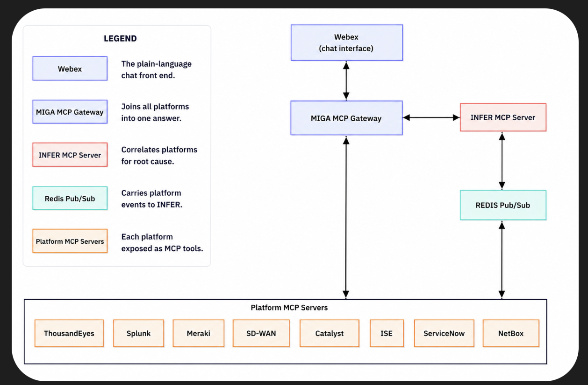
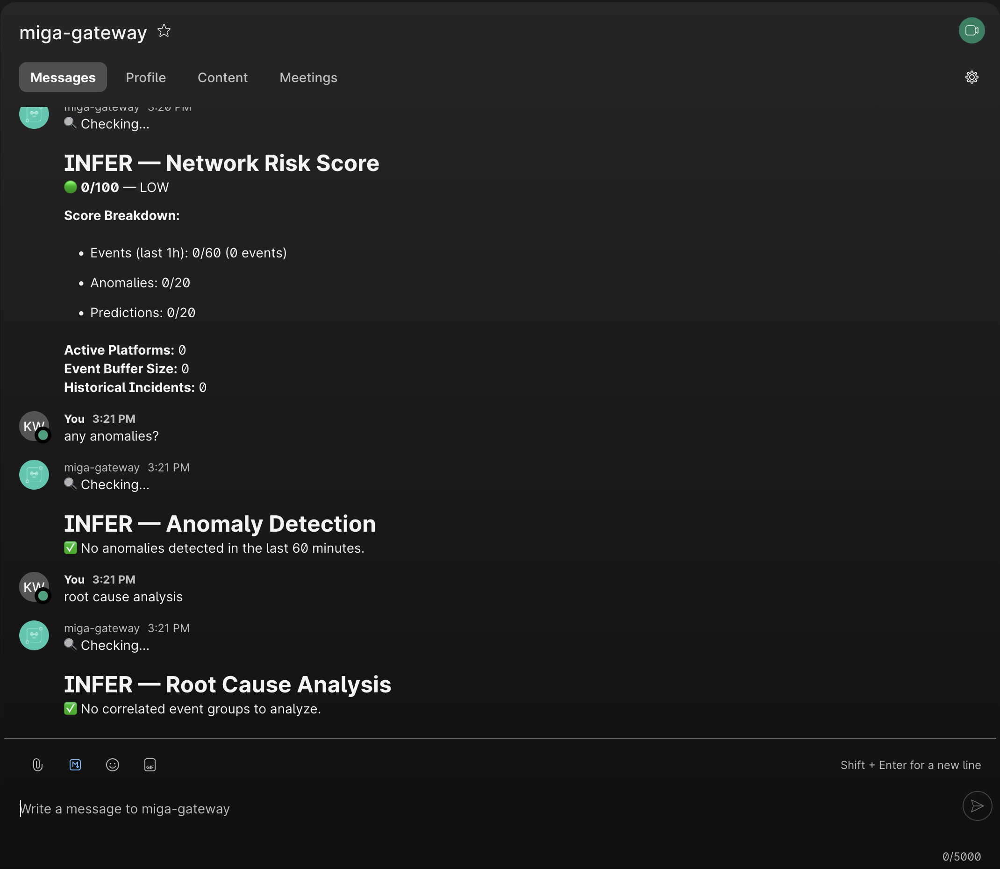

# MIGA - MCP Intelligence Gateway Architecture
[](LICENSE)
[](https://python.org)
[](https://modelcontextprotocol.io)
[](https://agntcy.org)
[](#platform-coverage)
[](https://github.com/astral-sh/ruff)
[](https://developer.cisco.com/codeexchange/)
[](https://developer.cisco.com/codeexchange/github/repo/keewillidevnet/miga-mcp-gateway)
[](https://developer.cisco.com/codeexchange/devenv/keewillidevnet/miga-mcp-gateway/)
[](https://developer.cisco.com/codeexchange/github/repo/keewillidevnet/miga-mcp-gateway)


> A unified intelligence layer that **aggregates and fuses** AI/ML and operational
> data from real, published MCP servers across the network ecosystem into a single,
> consistent, role-based interface for analysis, automation, and decision support,
> with a conversational Webex chat interface.

---

## Architecture

<p align="center">
  
</p>

**Verified:** 9/9 OASF records (8 platforms + INFER) published to an AGNTCY Directory and pulled back by CID at schema 1.0.0. MCP client transports over HTTP/SSE and stdio.

The gateway never re-vendors upstream server logic. It opens an MCP client session over each server's native transport (declared in the registry) and forwards `tools/list` / `tools/call`. Connection details are **config-driven**, never hardcoded.

## Overview

Modern enterprise networks span many platforms: Cisco ThousandEyes, Splunk, Cisco Meraki, Catalyst SD-WAN, Catalyst Center, ISE, ServiceNow, NetBox, and more. Each is its own silo, with its own telemetry, access model, and dialect, and each can only answer about itself. Getting data out of any one of them was never the hard part; seeing across all of them at once is.

That is the gap MIGA (MCP Intelligence Gateway Architecture) fills. It is built on the Model Context Protocol (MCP), an open standard that lets a system expose its data and actions as a set of self-describing tools any client can call the same way, instead of through a bespoke, vendor-specific API; a platform's MCP server is the component that offers those tools. Rather than reimplementing platform integrations, the MIGA gateway connects to each platform's real, published MCP server as an MCP client, which turns every platform into one common contract. A config-driven registry routes each request by role across six domains (observability, security, automation, configuration, compliance, and identity), and every server MIGA fronts is published as an OASF capability record to an AGNTCY Directory, so the set is discoverable by capability. MIGA normalizes the replies into a single schema keyed to resolved entities and adds the cross-platform correlation no single platform can provide, all without storing a second copy of anyone's telemetry.

Users interact conversationally through a Webex bot that embeds an MCP client, converting natural language into structured MCP tool calls and returning the results as formatted, interactive responses in the chat, with grounded conversational replies coming as the LLM layer lands. You ask once, in plain language, instead of opening a separate console for every platform and stitching the answers together by hand.

At the center is INFER (Infrastructure Network Fusion Engine for Reasoning), MIGA's one original service and the piece that does the cross-platform reasoning: correlation, root-cause analysis, anomaly detection, and risk scoring. Instead of ingesting and holding a continuous firehose, it reasons over the normalized, entity-resolved output of the other servers, working from the distilled signals each platform already surfaces and pulling deeper detail only when a question calls for it. Every conclusion it returns is tied back to the evidence behind it.

## Quick Start

MIGA runs end to end with no external platform credentials. The gateway and INFER run
locally; the eight external platforms (ThousandEyes, Splunk, Meraki, SD-WAN, Catalyst
Center, ISE, ServiceNow, NetBox) report unreachable until you configure them.

```bash
# Clone the repository
git clone https://github.com/keewillidevnet/miga-mcp-gateway.git && cd miga-mcp-gateway

# Launch the core stack (gateway, INFER, redis); external platforms are built separately
docker compose up -d redis gateway infer-mcp

# Check reachability of every registered server
python -m packages.cli.miga_cli status
```

Then open Webex and message the MIGA bot. These commands return real output with no
credentials:

| Command | What it does | Without credentials |
|---|---|---|
| `help` | Capability menu | Full menu |
| `gateway status` | Gateway health and routing table | Real data |
| `network status` | Per-server reachability | INFER reachable; the eight platforms unreachable |
| `risk score` | INFER composite risk | Runs; reads 0/100 until telemetry flows |
| `correlate events` | INFER event correlation | Runs; empty until telemetry flows |
| `root cause analysis` | INFER root cause | Runs; empty until telemetry flows |
| `any anomalies?` | INFER anomaly detection | Runs; empty until telemetry flows |
| `predict failures` | INFER predictive analysis | Runs; empty until telemetry flows |

The INFER commands return real, structured output immediately. Scores and findings stay
empty until the external platforms are configured and feed telemetry into INFER. See
`docs/BOT_DEMO.md` for a full credential-free walkthrough with live evidence.

To bring up the eight external platforms: copy the environment template and add
credentials grouped by platform (`cp .env.example .env`), then build the external
community server images referenced by docker-compose (Meraki, ISE, NetBox, SD-WAN) from
their upstream repos. See `MIGRATION.md`. Everything in Use Case Scenarios below assumes
the platforms are configured this way.

## Webex Bot

The Webex bot is a conversational interface to the gateway: rule-based NLP turns a
message into a gateway tool call (the bot embeds an MCP client over streamable-http) and
renders the reply as Markdown or an Adaptive Card.

| Capability | Status |
|------------|--------|
| Conversational interface (NLP -> gateway -> Webex) | ✅ Implemented |
| MCP client to the gateway (streamable-http) | ✅ Implemented (internal HTTP dev fallback available) |
| Webhook self-registration | ✅ Implemented (`python -m packages.webex_bot.register_webhook`) |
| Credential-free live demo (INFER + `network_status` + `gateway_health`) | ✅ Implemented; see [docs/BOT_DEMO.md](docs/BOT_DEMO.md). Verified live via docker compose + cloudflared tunnel. |
| Multi-platform live data | 🔲 Requires platform credentials (separate step) |
| Automation / HITL approval | 🟡 Partial: the bot acknowledges approve/reject, but releasing a held action on the decision is not yet wired. |



*Credential-free demo in Webex: INFER returns risk score, anomaly detection, and root cause analysis with no external platform credentials; readings stay empty until platform telemetry flows.*

A credential-free demo exercises INFER plus status with no external platform credentials
and an ephemeral tunnel for the webhook (no standing host). Dev mode bypasses Entra JWT.
Full multi-platform operation requires credentials and is a separate step; there is no
all-8-platform live run claimed here.

### Running the bot (credential-free)

```bash
# ===========================================================
#  Run the MIGA bot with no external platform credentials
# ===========================================================

# ---- Prerequisites (do these once) ------------------------
cloudflared --version            # need a tunnel tool (or: ngrok version)
# Create a Webex bot at https://developer.webex.com/my-apps (Create a Bot);
# copy its access token and its bot email (ends in @webex.bot).
git clone https://github.com/keewillidevnet/miga-mcp-gateway.git
cd miga-mcp-gateway
cp .env.example .env
# Edit .env and set exactly these two values:
#   WEBEX_BOT_ACCESS_TOKEN=<your bot access token>
#   WEBEX_BOT_EMAIL=<your bot's @webex.bot email>
pip install aiohttp httpx mcp    # deps for the local (non-container) processes

# ---- Option A: one command (recommended) ------------------
# Brings up the stack, starts the bot, opens the tunnel, and
# registers the webhook, with preflight checks at each step.
./scripts/run_demo.sh            # add --mode http if the handshake misbehaves
# When it prints READY, skip to "Try it" below.

# ---- Option B: manual, step by step (two terminals) -------
# Terminal 1 - stack + bot (leave running):
docker compose up -d redis gateway infer-mcp
# Wait for INFER to come up (a few seconds after 'up -d'), then probe:
until docker compose exec gateway curl -sf http://infer-mcp:8007/health; do sleep 2; done
# -> {"status":"ok","service":"infer_mcp"}
set -a; source .env; set +a
export MIGA_GATEWAY_URL=http://localhost:8000
export MIGA_BOT_GATEWAY_MODE=mcp
python -m packages.webex_bot.app                                    # serves :9000; leave running

# Terminal 2 - tunnel + webhook:
cloudflared tunnel --url http://localhost:9000 > /tmp/miga-tunnel.log 2>&1 &
sleep 6
grep -o 'https://[a-z0-9-]*\.trycloudflare\.com' /tmp/miga-tunnel.log   # copy the URL it prints
set -a; source .env; set +a
export WEBEX_PUBLIC_URL=<paste-the-https-URL-above>
python -m packages.webex_bot.register_webhook                          # expect: webhooks created

# ---- Try it (type these in Webex, not the shell) ----------
#   help
#   gateway status      # live data immediately
#   network status      # live data immediately
#   risk score          # runs; reads 0/100 until telemetry flows

# ---- Teardown ---------------------------------------------
kill %1                 # Terminal 2: stop the tunnel
# Terminal 1: Ctrl-C the bot, then:
docker compose down
```

## Platform Coverage

The gateway routes to **8 real external MCP servers** plus the MIGA-original INFER
engine. Connection details for every row live in `config/server-registry.yaml`.

| Platform | Status | Source / Endpoint | Roles Served |
|----------|--------|-------------------|--------------|
| Cisco ThousandEyes | Official | `api.thousandeyes.com/mcp` (remote HTTP) | Observability |
| Splunk | Official | Splunk instance `:8089/services/mcp` (remote HTTP) | Observability, Security |
| Cisco Meraki | CiscoDevNet community | [CiscoDevNet/meraki-magic-mcp-community](https://github.com/CiscoDevNet/meraki-magic-mcp-community) | Observability, Configuration, Security |
| Cisco Catalyst SD-WAN | CiscoDevNet community | [CiscoDevNet/catalyst-sdwan-mcp-community](https://github.com/CiscoDevNet/catalyst-sdwan-mcp-community) (docker stdio) | Configuration, Automation |
| Cisco Catalyst Center | Community | [richbibby/catalyst-center-mcp](https://github.com/richbibby/catalyst-center-mcp) (stdio) | Observability, Configuration, Automation |
| Cisco ISE | Community | [pamosima/network-mcp-docker-suite](https://github.com/pamosima/network-mcp-docker-suite) (upstream [automateyournetwork/ISE_MCP](https://github.com/automateyournetwork/ISE_MCP)) | Identity, Compliance |
| ServiceNow | Community | [echelon-ai-labs/servicenow-mcp](https://github.com/echelon-ai-labs/servicenow-mcp) (stdio) | Automation, Observability |
| NetBox | Official (NetBox Labs) | [netboxlabs/netbox-mcp-server](https://github.com/netboxlabs/netbox-mcp-server) (read-only) | Configuration, Compliance |
| INFER | MIGA-original | `servers/infer_mcp` | Observability, Security, Compliance |

## Use Case Scenarios

> These scenarios show MIGA with the external platforms configured with credentials.
> The multi-platform results below (health cards, correlated incidents, NetBox inventory)
> require those credentials. For what runs with no credentials, see Quick Start above.

### 🚨 NOC / Incident Response

A network engineer gets paged at 2 AM. Instead of logging into four different dashboards, they open Webex on their phone:

> **Engineer:** `network status`

MIGA fans out across Catalyst Center, Meraki, ThousandEyes, and Splunk simultaneously, returning a single health card with scores, top issues, and active alerts. ThousandEyes is flagging packet loss on a WAN path.

> **Engineer:** `correlate events last 30 minutes`

INFER finds the ThousandEyes path loss overlaps with a Meraki VPN tunnel flap and a Catalyst Center device error, all affecting the same branch site. It returns a root cause analysis card pointing to a failing upstream switch with recommended actions.

> **Engineer:** `run show interface gi1/0/1 on switch-br-01`

The bot presents an **approval card**. The on-call lead taps ✅ **Approve**. The command executes through Catalyst Center and results render inline. Total time: **3 minutes, never left Webex.**

---

### 🔒 Security Operations

A SOC analyst opens the Network Security Webex space:

> **Analyst:** `critical security events`

Splunk returns active detections from the SIEM, and Meraki flags anomalous appliance traffic.

> **Analyst:** `risk score`

INFER calculates a composite **78/100**: the top contributor is an endpoint with repeated authentication failures correlated against a Splunk alert.

> **Analyst:** `quarantine endpoint AA:BB:CC:DD:EE:01`

An approval card fires to the security lead. One tap, and Cisco ISE isolates the device. The entire **triage-to-containment loop** happened in a Webex space without touching a single console.

---

### 🔧 Change Management / Maintenance Windows

> **Change Manager:** `predict failures`

INFER analyzes recent telemetry patterns and flags that three switches in Building C have incrementing CRC errors, suggesting a cascading failure risk.

> **Change Manager:** `compare network health before and after`

The bot pulls Catalyst Center health scores and ThousandEyes test baselines, showing the change improved path latency by 12ms with no new issues.

---

### ✅ Compliance Auditing

> **Auditor:** `compliance posture`

Cisco ISE returns endpoint posture stats, NetBox supplies source-of-truth inventory and change history, and INFER calculates drift from baseline. The auditor has **exportable evidence** without requesting access to any platform.

---

### 🎫 Closed-Loop Incident Management (ServiceNow)

INFER detects a correlated branch outage across ThousandEyes, Meraki, and Catalyst Center:

> **MIGA Bot:** 🔴 **Correlated incident detected:** WAN degradation at Site-A, 3 platforms affected, root cause: upstream circuit CKT-00412 packet loss.

The bot auto-creates a ServiceNow P1 incident with the full RCA attached.

> **Engineer:** `status INC0078432`

The bot pulls the live ticket: assigned to Network Operations, provider ticket open.

> **Engineer:** `resolve INC0078432: Lumen fiber repair completed, circuit stable`

MIGA updates the ServiceNow ticket with resolution notes, INFER confirms health scores recovered, and the incident closes. **Full lifecycle, detection to resolution, in one Webex thread.**

---

### 🗺️ Infrastructure Context & Impact Analysis (NetBox)

INFER flags an anomaly on `10.1.50.1`. Without NetBox, that's just an IP address. With NetBox:

> **Engineer:** `what is 10.1.50.1?`

NetBox resolves it: **Core Switch 3**: Catalyst 9300-48P, Rack 14, Building C, serial FCW2345L0AB, running IOS-XE 17.09.04a.

> **Engineer:** `what's the blast radius?`

NetBox maps the relationships: 3 downstream access switches serving **240 users**, upstream WAN edge on Lumen circuit CKT-00412. The engineer now knows this is a high-impact event before a single user calls the help desk.

---

## AGNTCY Integration

MIGA is built to **align with** Cisco's [AGNTCY](https://agntcy.org) Internet of Agents
framework (Linux Foundation). Honest status of each capability:

| Capability | Status | Detail |
|------------|--------|--------|
| OASF capability records | ✅ **Implemented** (verified live) | One record per server under `oasf/records/*.record.json`; all 9 validate against the OASF **1.0.0** schema server (0 errors / 0 warnings). |
| Directory publication | ✅ **Implemented** (verified live) | At startup the gateway publishes **9/9** records to a real AGNTCY Directory (`dir-apiserver`) via the **`agntcy-dir` 1.3.0 SDK**, each returns a content-addressed **CID**; records **pull back by CID** at `schema_version` 1.0.0. Best-effort: falls back to standalone if the directory is down. |
| Registry-driven routing | ✅ **Implemented** | Routing comes entirely from `config/server-registry.yaml` (loaded at startup + periodically reloaded); add a server and it's picked up with no code change. |
| Directory-search routing discovery | 🟢 **Implemented** (opt-in; verified live) | With `MIGA_DISCOVERY_ROUTING=1` the gateway resolves each role's servers via a live directory search (skills to records to `miga_registry_ref` to registry connection). The static registry is the default and the guaranteed fallback. In a single-instance deployment the search rediscovers MIGA's own published records; multi-party discovery lands under federation. See `DISCOVERY_VERIFY.md`. |
| Identity / Agent Badges | 🔲 **Planned** | `IdentityBadge` is a scaffold only; no cryptographic signing or verification. |
| SLIM (v2) messaging | 🔲 **Planned** | Inter-service messaging is Redis pub/sub today; quantum-safe AGNTCY SLIM is future. |
| Observability (v2) | 🔲 **Planned** | No OpenTelemetry tracing wired. |

> **Verified live** (networked Docker host): gateway loaded 9 specs → published 9/9 OASF
> records to `dir-apiserver` + `zot` + `postgres` + `reconciler` (agntcy-dir 1.3.0 SDK),
> each returning a CID, with a pull-by-CID round-trip at `schema_version` 1.0.0. See
> `VERIFY_DIRECTORY.md`.

**What is real and load-bearing:** a registry-driven gateway fronting 8 real external
MCP servers plus INFER, with a validated OASF 1.0.0 capability record per server, now
also published to a real AGNTCY Directory.

## Deployment

For local development, see [Quick Start](#quick-start).

**Production (Kubernetes + Helm):**
```bash
helm install miga ./helm/miga --namespace miga --create-namespace
```
(The Helm chart deploys the gateway, Webex bot, and INFER. External platform servers are
provisioned out-of-band and referenced via the registry.)

## Project Structure

```
miga-mcp-gateway/
├── config/
│   ├── server-registry.yaml         # Authoritative: how the gateway connects to each server
│   └── server-registry.schema.json  # JSON schema the registry is validated against
├── oasf/
│   ├── OASF_RECORDS.md              # OASF record authoring guide
│   └── records/*.record.json        # One OASF capability record per registered server
├── miga_shared/
│   ├── registry.py                  # Registry loader (parse, validate, resolve ${ENV})
│   ├── transport.py                 # MCP client transport: HTTP/SSE + stdio (docker run -i)
│   └── ...                          # auth, AGNTCY, models, formatters
├── packages/
│   ├── gateway/                     # Gateway MCP Server (registry-driven role routing)
│   ├── webex_bot/                   # Webex Bot (NLP + MCP Client + Adaptive Cards)
│   └── cli/                         # miga-cli tool
├── servers/
│   └── infer_mcp/                   # INFER fusion engine — MIGA's only original server
├── helm/miga/                       # Helm chart (gateway, bot, INFER)
├── docs/                            # Documentation
├── docker-compose.yml               # Local cluster (core + compose servers)
└── .env.example                     # Environment template (every registry env var)
```

## Contributing

To add a platform: add an entry to `config/server-registry.yaml`, author its OASF
record under `oasf/records/`, and wire any env vars in `.env.example`. See
[docs/CONTRIBUTING.md](docs/CONTRIBUTING.md).

## License

Apache 2.0. See [LICENSE](LICENSE)
